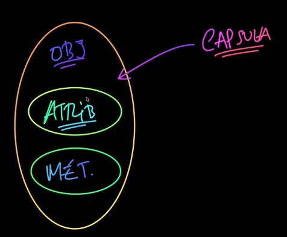

# 🌼 Typescript: Formação Dev
## ✨ Programação Orientada a Objetos
- Objetos
- Classes
- Atributos
- Métodos 

**Pilares da Orientação a Objetos**: 
- Encapsulamento
- Herança 
- Polimorfismo

## ✨ Iniciando o Typescript
```js
npm init - y
```

```js
deno run src/index.html
```

**Instalando dependências do node**: 
```js
npm i -y
npm i -D typescript ts-node-dev
npx tsc --init
npm run build
node dist/index.js
```

**Instalando dependências para os testes**
```js
npm i -D jest ts-jest

// Em jest.config.ts: 
module.exports = {
  preset: 'ts-jest', 
  testEnvironment: 'node', 
}

// Instalar dependência de jest
npm i -D @types/jest @types/node

// Instalar dependência para um id único
npm i uuid @types/uuid
```

## ✨ Usando Tipos
###  ✏︎ Variáveis
```js
console.log('Variaveis'); 

// string
let nome: string = "João"; 
console.log(nome); 

//boolean
let estaChovendo: boolean; 
estaChovendo = true; 
console.log(estaChovendo); 

// number
let numero: number = 30; 
console.log(numero); 
numero = 32; 
console.log(numero); 


// tipo any
let variavel : any = 4; 
variavel = 'Texto'; 
variavel = 32; 
variavel = { nome: 'João'}; 
console.log(variavel); 
```


### ✏︎ Arrays
```js
// do tipo string e do tipo number
let hobbies: any[] = ['Cozinhar', 'Praticar esportes', 123]; 
console.log(hobbies[0]); 
console.log(typeof hobbies); 
```

```js
const endereco: [string, number] = ["Grazielle Café", 30]; 
console.log(endereco); 
```


```js
###  ✏︎ Enum
enum DiaSemana { 
  DOMINGO = 'domingo', 
  SEGUNDA = 'segunda', 
  TERCA = 'terca', 
  QUARTA= 'quarta', 
  QUINTA = 'quinta', 
  SEXTA = 'sexta',
  SABADO = 'sabado'
}

console.log(DiaSemana.DOMINGO); //domingo

let dia: DiaSemana; 
dia = DiaSemana.QUINTA; 
console.log(dia); 
```

```js
const VendaStatus =  {
  INICIADA:  'iniciada', 
  CONCLUIDA:  'concluida', 
  CANCELADA:  'cancelada'
} as const

console.log(VendaStatus.INICIADA)
```

```js
const ERROS = { 
  NOME_NULO: 'nome_nulo', 
  EMAIL_NAO_ENCONTRADO: 'email_nao_encontrado',
  URL_INVALIDA: 'url_invalida',
}

let erro: string 
erro = ERROS.NOME_NULO;
console.log(erro); 
```

```js
type StatusVendas = 'iniciada' | 'concluida' | 'cancelada';

let st: StatusVendas = "concluida";
console.log(st); 

st =  "iniciada"; 
console.log(st); 
```

### ✏︎ Funções 
```js
// Código: 

export function saudacao (nome: string): string { 
  return `Ola, passar bem ${nome}!`   
}

export function multiplicar (numero1: number, numero2: number) : number {
  return numero1 * numero2; 
};

// Testes

import { multiplicar, saudacao } from "../../src/tipos/funcoes";

test('Deve retornar uma saudacao baseada na hora atual', () => {
  const s = saudacao('Grazielle'); 
  expect(s).toBe('Ola, passar bem Grazielle!')
});

test('Deve realizar de forma correta a multiplicação de dois números', () => {
  const resultado = multiplicar(4,5); 
  expect(resultado).toBe(20); 
});
```

### ✏︎ Atribuido a saída de uma função
```js
function somar(n1: number, n2: number) => number {
  return n1 + n2; 
}
``````

### Exercício sobre objetos
```js
type Produto = {
  nome: string, 
  preco: number, 
  desconto: number, 
  precoComDesconto: () => number
}

let produto: Produto = {
  nome: 'Vestido para casamento', 
  preco: 279.90, 
  desconto: 0.1, 
  precoComDesconto () {
    return this.preco * (1 - this.desconto);
  }
}

console.log(produto.nome); 
console.log(produto.precoComDesconto()); 
```

## ✨ Programação Orientada a Objetos
### Paradigmas de Programação 
- Procedural: if/else, for/ while.
- Programação Orientada a Objetos: classes e métodos (funções). Métodos são funções dentro de uma classe. 
- Funcional 

### Programação Orientada a Objetos
POO: Como os dados se interagem com o algoritmo e como o algoritmo se interage com os dados. 

-  Dados: atributos
- Algoritmo: métodos

**Encapsulamento**



### Classe vs Objetos
- A classe ela funciona como um molde, a partir de uma classe eu posso instanciar tantos objetos que eu queira 